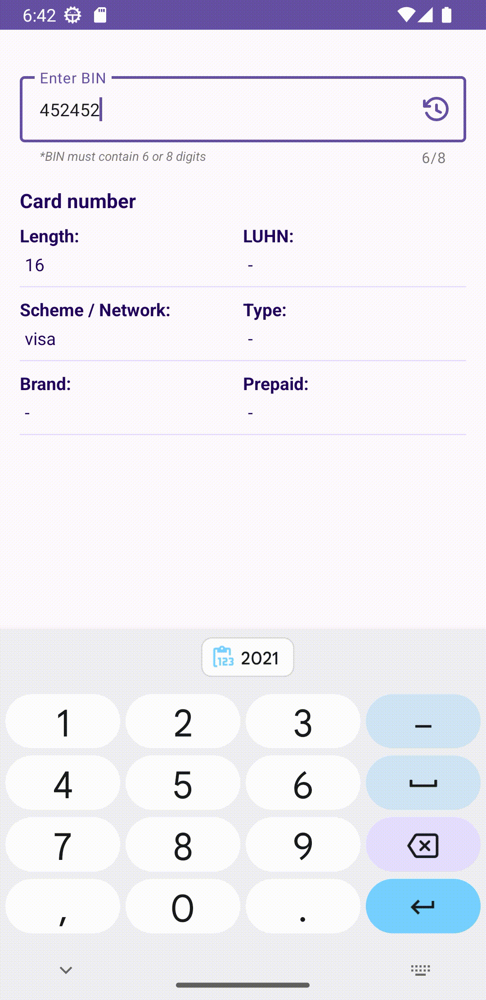
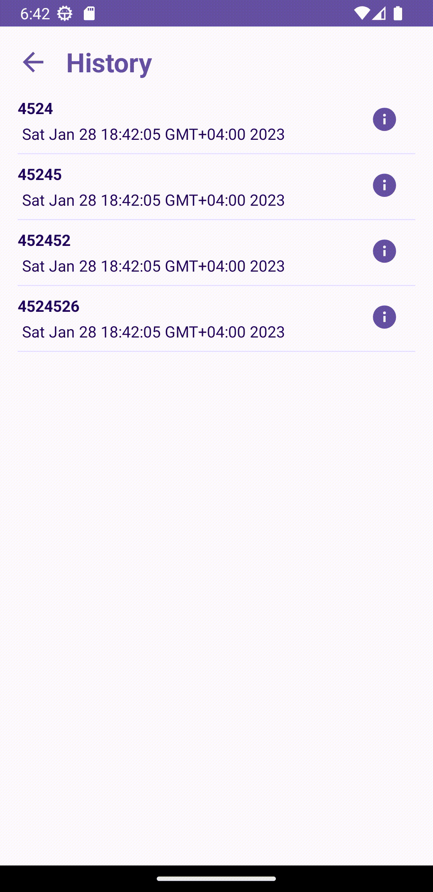

## Отборочное задание - ШИФТ ЦФТ 2023 <br>
## Search BIN Application


Implementation of the application using the [BINLIST.NET API](https://binlist.net/).

### Architecture

* MVVM 
* [Kotlin](https://kotlinlang.org/) 100%, [Coroutines](https://github.com/Kotlin/kotlinx.coroutines),
  [Flow](https://kotlinlang.org/docs/flow.html)

### Preview
<p align="center">



</p>


### Libraries
* Di
  * [Hilt Android](https://mvnrepository.com/artifact/com.google.dagger/hilt-android)
  * [Hilt Processor](https://mvnrepository.com/artifact/com.google.dagger/hilt-compiler)
* Retrofit2 & OkHttp3
  * [Converter: Gson](https://mvnrepository.com/artifact/com.squareup.retrofit2/converter-gson)
  * [Retrofit](https://mvnrepository.com/artifact/com.squareup.retrofit2/retrofit)
  * [OkHttp Client](https://mvnrepository.com/artifact/com.squareup.okhttp3/okhttp)
  * [OkHttp Logging Interceptor](https://mvnrepository.com/artifact/com.squareup.okhttp3/logging-interceptor)
* Room
  * [Android Room Runtime](https://mvnrepository.com/artifact/androidx.room/room-runtime)
  * [Android Room Compiler](https://mvnrepository.com/artifact/androidx.room/room-compiler)
* Coroutines
  * [Kotlinx Coroutines Core](https://mvnrepository.com/artifact/org.jetbrains.kotlinx/kotlinx-coroutines-core)
* Others
  * [Fragment Kotlin Extensions](https://mvnrepository.com/artifact/androidx.fragment/fragment-ktx)
  * [Android Support RecyclerView](https://mvnrepository.com/artifact/androidx.recyclerview/recyclerview)
  * [Timber](https://mvnrepository.com/artifact/com.jakewharton.timber/timber)

# License

```
Copyright 2023 Alexey Mukovozov

Licensed under the Apache License, Version 2.0 (the "License");
you may not use this file except in compliance with the License.
You may obtain a copy of the License at

    http://www.apache.org/licenses/LICENSE-2.0

Unless required by applicable law or agreed to in writing, software
distributed under the License is distributed on an "AS IS" BASIS,
WITHOUT WARRANTIES OR CONDITIONS OF ANY KIND, either express or implied.
See the License for the specific language governing permissions and
limitations under the License.
```
